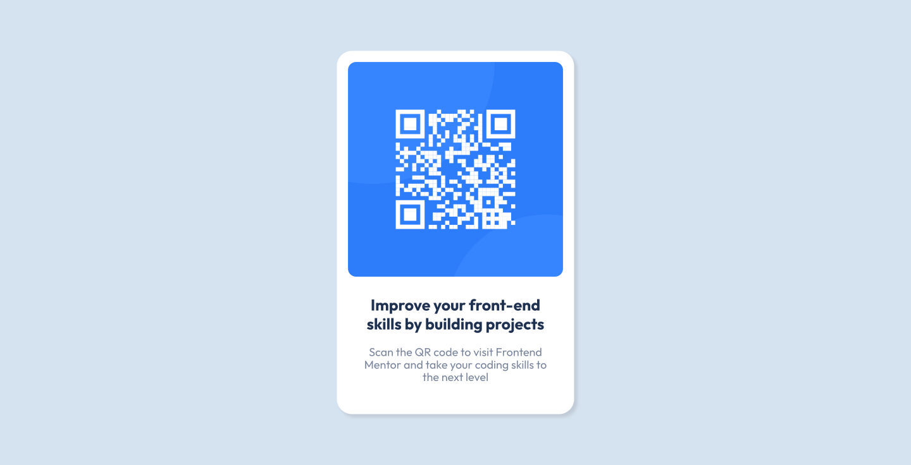

# Frontend Mentor - QR Code Component
This is a solution to the [Product preview card component challenge on Frontend Mentor](https://www.frontendmentor.io/challenges/qr-code-component-iux_sIO_H/hub)

## Table of contents

- [Overview](#overview)
  - [The challenge](#the-challenge)
  - [Screenshots](#screenshots)
  - [Links](#links)
- [My process](#my-process)
  - [Built with](#built-with)

## Overview

### The challenge

- Build out this QR code component and get it looking as close to the design as possible.

### Screenshots

### Links

- Solution URL: [solution URL](https://www.frontendmentor.io/solutions/qr-code-component-7CHacL4yUl)
- Live Site URL: [live site URL](https://dashaunn.github.io/FEM-qr-code-component-main/)

## My process

### Built with

- Semantic HTML5 markup
- CSS custom properties
- Flexbox